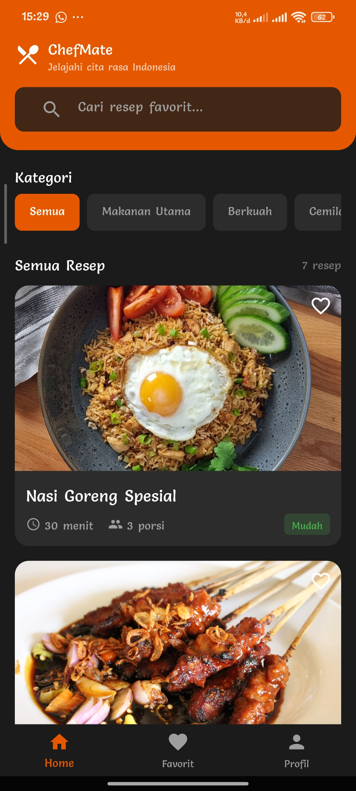
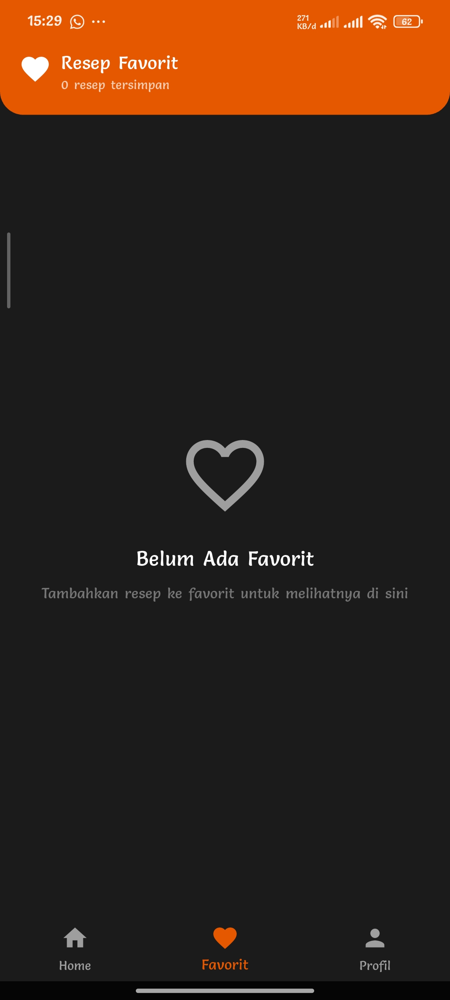
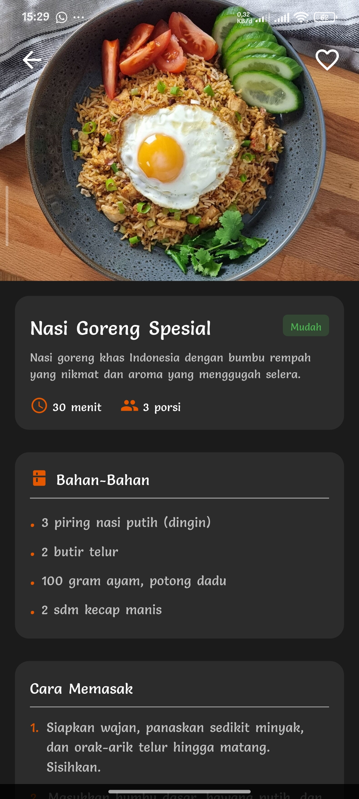
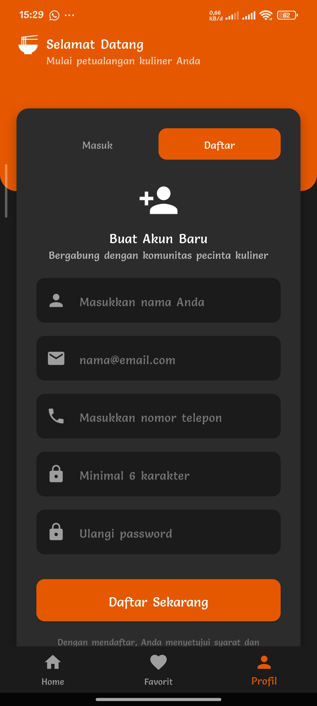
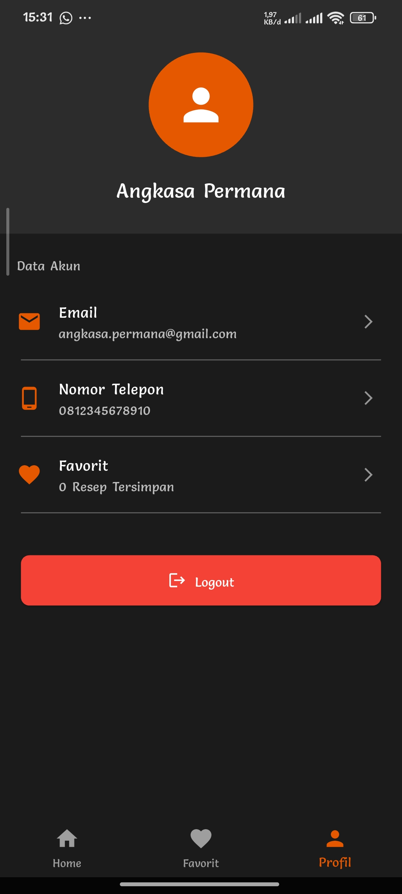

# CHEFMATE - Aplikasi Katalog Resep Makanan

## 🎬 TENTANG CHEFMATE
**ChefMate** adalah aplikasi katalog resep makanan berbasis mobile yang dirancang untuk membantu pengguna dalam menemukan resep masakan. Aplikasi ini menampilkan beberapa jenis dan macam resep masakan dengan detail bahan-bahan dan cara memasaknya. Pengguna dapat mencari resep di kolom pencarian, mengelompokkan resep berdasarkan jenis makanan/minuman, serta menyimpan resep masakan favorite mereka. 

## 🎯 TEMA DAN TUJUAN APLIKASI
Tema : Katalog Resep Masakan
Tujuan : Merancang dan mendesain antarmuka (GUI) aplikasi mobile menggunakan framework flutter dengan menerapkan konsep layout, widget, navigasi antar halaman, dan arsitektur NVVM (Navigator-View-ViewModel-Model).

## 📱 DAFTAR HALAMAN BESERTA FUNGSINYA
  1. HomeView (lib/view/home_view.dart)
     Sebagai beranda aplikasi, menampilkan daftar makanan dan resep. Menerapkan fitur filter kategori dan pencarian Real-time melalui ViewModel.
     
  3. FavoriteView (lib/view/favorite_view.dart)
      Sebagai daftar favorite, menampilkan resep yang ditandai oleh user sebagai favorite.
     --
     
  5. DetailView (lib/view/detail_view.dart)
      Menampilkan informasi lengkap resep (bahan dan langkah memasak).
     --
     
  7. Login/Register (lib/view/login_view.dart)
      Berfungsi sebagai tempat registrasi dan login untuk pengguna.
     --
     
  9. AccountView (lib/view/account_view.dart)
      Halaman profile pengguna yang menampilkan detail profile seperti username, email, dan nomor telepon yang terdaftar saat registrasi.
     --
     

## 🧭 PANDUAN PENGGUNAAN APLIKASI
  1. Memulai Sesi (Login/Registrasi)
      - Akses menu "Profil" di navigation bar.
      - Untuk pengguna baru, pilih tab "Daftar" dan isi data yang diperlukan (Nama, Email, dan Password (Minimal 6 karakter)) dan tekan "Daftar Sekarang".
      - Aplikasi akan mengarahkan anda kembali ke tab "Masuk" dan mengisi password yang telah terisi saat registrasi (daftar).
  2. Menggunakan Fitur Katalog
      - Pencarian cepat: Gunakan "Search Bar" di bagian atas HomeView. ketik nama resep (misalnya "Nasi") untuk langsung memfilter daftar yang tersedia.
      - Filter Kategori: Gunakan tombol-tombol kategori horizontal ("Semua", "Makanan Utama", "Berkuah", "Cemilan", "Minuman") untuk memfilter resep makanan berdasarkan jenisnya.
      - Melihat Detail: Pilih salah satu card resep (Misalnya sate ayam madura), halaman akan menampilkan daftar bahan dan cara memasaknya langkah demi langkah.
  3. Menyimpan Resep Favorite
      - Pada card resep di HomeView atau di halaman Detail, ketuk ikon hati (♡) di pojok kanan atas card.
      - Aplikasi akan menyimpan resep tersebut di halaman favorite.
      - Akses menu favorite di bottom navigation bar untuk melihat semua resep yang telah disimpan.
  4. Mengelola Akun
      - Akses menu Profil (setelah login).
      - Di halaman tersebut menampilkan username, email, dan nomor telepon yang telah didaftarkan.
      - Untuk keluar dari sesi, tekan tombol Logout berwarna merah di bagian bawah halaman.
